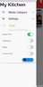
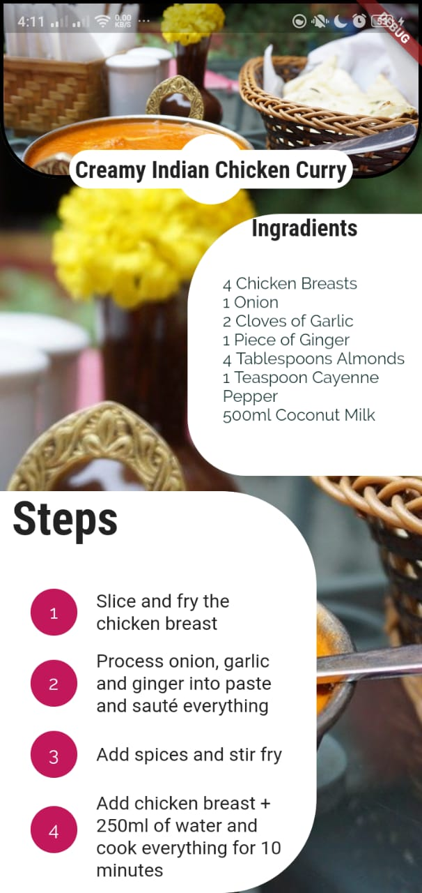
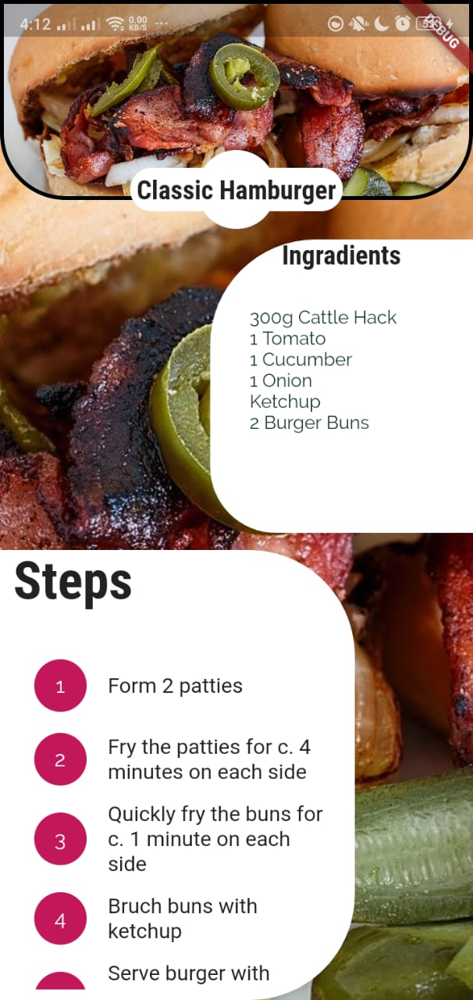
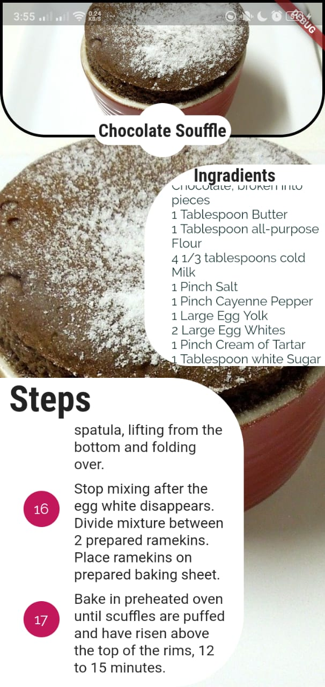
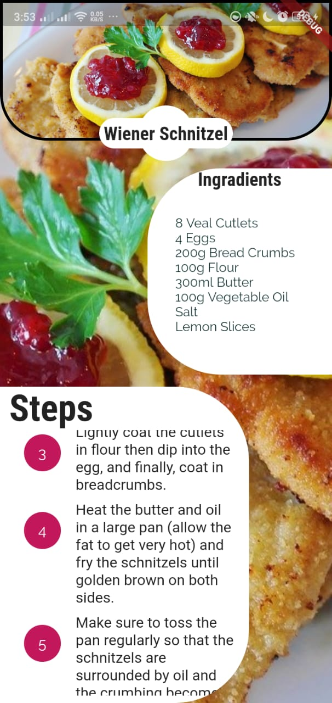
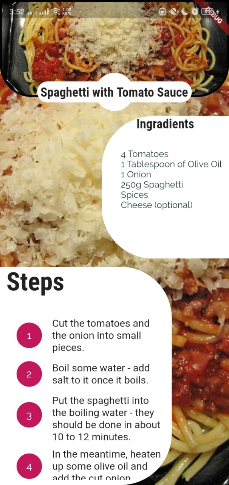
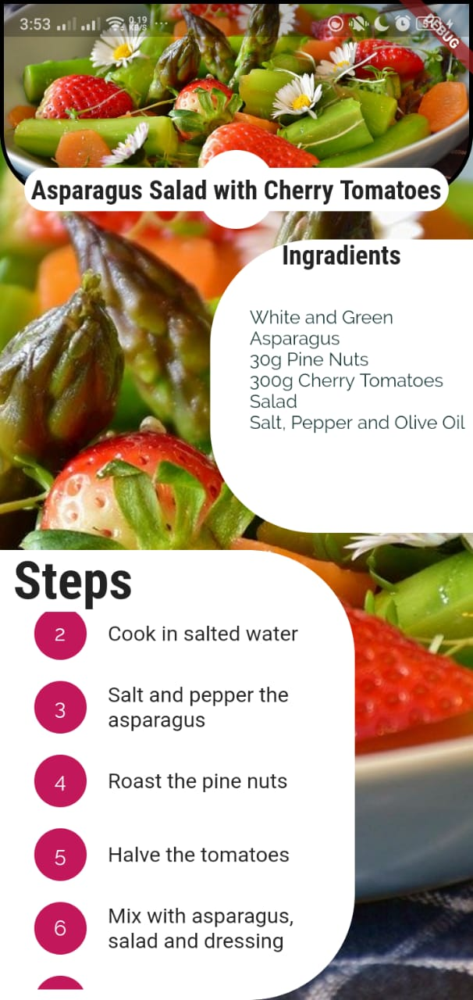
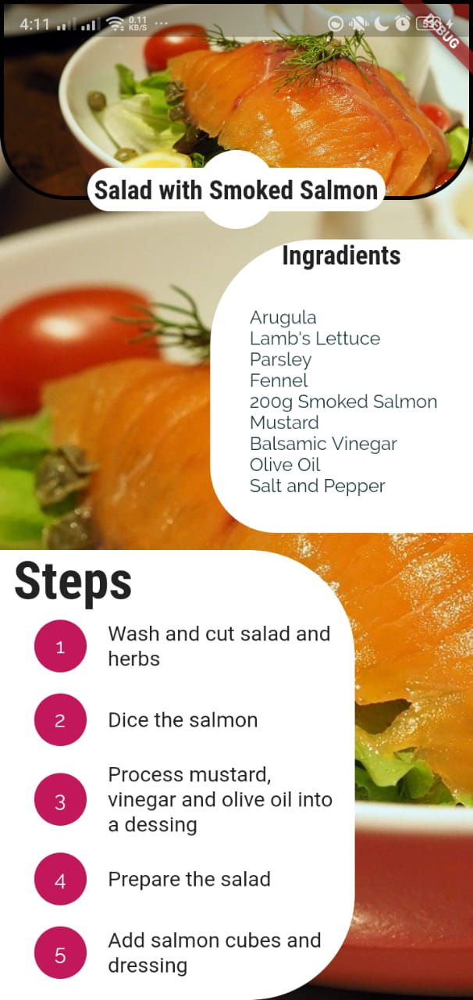

# **my_kitchen**
=======
A Flutter project To Show different Categories of Meals and how to cook the meal with steps and recipes

## Meal Screen

## All Meal of A specific Category Screen

<!--
        
-->

<!--

-->
